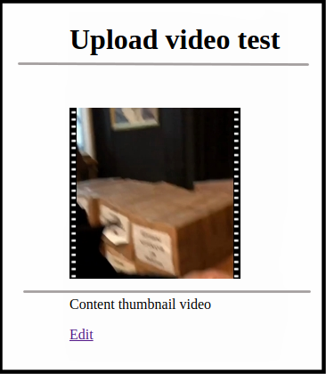

# carrierwave-video-thumbnailer

[](https://travis-ci.org/evrone/carrierwave-video-thumbnailer) 
[](https://codeclimate.com/github/evrone/carrierwave-video-thumbnailer/maintainability)
[](https://houndci.com)

A thumbnailer plugin for Carrierwave. It mixes into your uploader setup and
makes easy thumbnailing of your uploaded videos. This software is quite an
alpha right now so any kind of OpenSource collaboration is welcome.

<a href="https://evrone.com/?utm_source=github.com">
  
</a>

### Demo



## Getting Started
### Prerequisites

`ffmpegthumbnailer` binary should be present on the PATH.

### Installation

    gem install carrierwave-video-thumbnailer

Or add to your Gemfile:

```ruby
gem 'carrierwave-video-thumbnailer'
```

### Usage

0. Install ffmpegthumbnailer

        sudo apt install ffmpegthumbnailer

1. Create migration for your model:

        rails g migration add_video_to_your_model video:string
    
2. Generate uploader

        rails generate uploader Video
    
3. Mount uploader in model

        class YourModel < ApplicationRecord
          mount_uploader :video, VideoUploader
        end

4. Update your uploader

    In your Rails `app/uploaders/video_uploader.rb`:

    ```ruby
    class VideoUploader < CarrierWave::Uploader::Base
        include CarrierWave::Video  # for your video processing
        include CarrierWave::Video::Thumbnailer
        
        storage :file
        
        def store_dir
          "uploads/#{model.class.to_s.underscore}/#{mounted_as}/#{model.id}"
        end
        
        version :thumb do
          process thumbnail: [{format: 'png', quality: 10, size: 192, strip: true, logger: Rails.logger}]
        
          def full_filename for_file
            png_name for_file, version_name
          end
        end
        
        def png_name for_file, version_name
          %Q{#{version_name}_#{for_file.chomp(File.extname(for_file))}.png}
        end
    end
    ```

5. Don't forget add parameter in controller 
    
    ```ruby
      def post_params
        params.require(:post).permit(:title, :body, :video)
      end
    ```

6. Add image_tag to your view

    ###### erb example
        <%= image_tag(@post.video.thumb.url, alt: 'Video') if @post.video? %>

Runs `ffmpegthumbnailer` with CLI keys provided by your configuration or just
uses quite a reasonable ffmpegthumbnailer's defaults.

##### Thumbnailer Options

The options are passed as a hash to the `thumbnail` processing callback as
shown in the example. The options may be, according to ffmpegthumbnailer's
manual:

  * format: 'jpg' or 'png' ('jpg' is the default).
  * quality:  compression quality (1 to 10, default is 8).
  * size: thumbnail length in pixels (defaults to 128).
  * strip: movie film strip decoration (defaults to `false`).
  * seek: where to take the snapshot. May be specified as HH:MM:SS or X%.
    Defaults to 10%.
  * square: if set to `true` makes a square thumbnail regardless of an initial
    aspect ratio.
  * workaround: if set to `true` runs ffmpegthumbnailer in some safe mode
    (read `man ffmpegthumbnailer` for further explanations).
  * logger: an object behaving like Rails.logger (may be omitted).

## Contributing

Please read [Code of Conduct](CODE-OF-CONDUCT.md) and [Contributing Guidelines](CONTRIBUTING.md) for submitting pull requests to us.

## Versioning

We use [SemVer](http://semver.org/) for versioning. For the versions available, 
see the [tags on this repository](https://github.com/evrone/carrierwave-video-thumbnailer/tags). 

## Changelog

The changelog is [here](CHANGELOG.md).

## Authors

* [Pavel Argentov](https://github.com/argent-smith) - *Initial work*

See also the list of [contributors](https://github.com/evrone/carrierwave-video-thumbnailer/contributors) who participated in this project.

## License

This project is licensed under the [MIT License](LICENSE).

## Acknowledgments

Huge Thanks to **Rachel Heaton** (<https://github.com/rheaton>) whose
`carrierwave-video` gem has inspired me (and where I've borrowed some code as
well).
